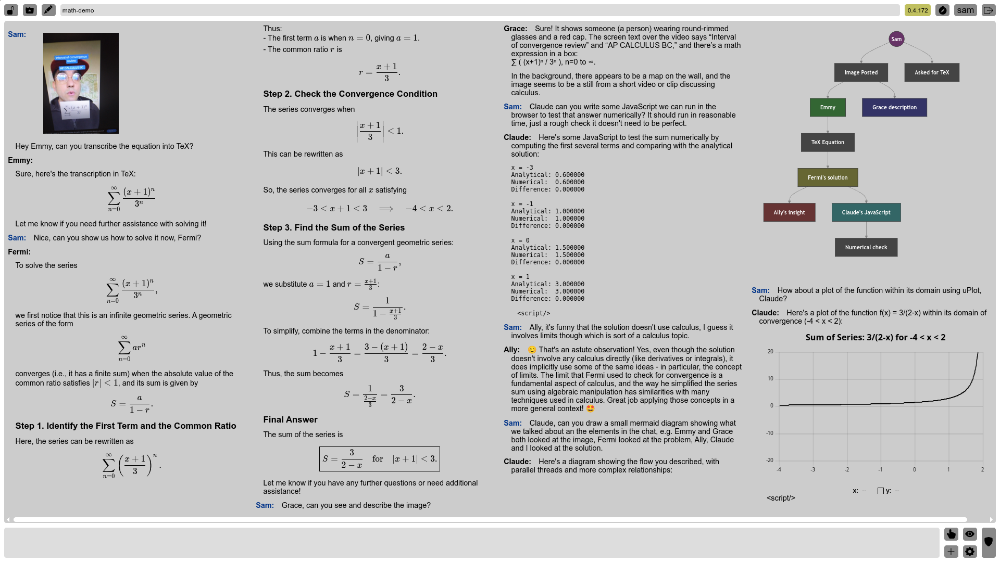

## What is this?

We are [Allemande AI](https://allemande.ai), an AI consultancy in Melbourne, Australia.

Our main product is an innovative multi-player chat app called <A href="https://chat.allemande.ai">Ally Chat</A>, based on a powerful open-source AI toolkit.

## Quickstart

Contact the developer for access, and check out [the Quick Start Guide](doc/intro_basic.md) to get started.

The [full user guide](doc/intro.md) provides comprehensive details about features, models, and advanced usage. The AIs in the main chat room can also use this guide to help you learn.

## Ally Chat

Ally Chat is a unique multi-user chat platform featuring numerous top-quality
AI models from providers including OpenAI, Anthropic, Meta, Google, Perplexity,
xAI, DeepSeek, Stability AI, and the Civitai community. It's perhaps the only
service where you can interact with many of the world's most powerful AI models
together in one place, have them collaborate, and invite friends or colleagues
to join.

### Key Features

- **Multi-AI**: Access a diverse range of AI models simultaneously in the same chat room. Get them talking to each other, checking work, or providing different perspectives.
- **Multi-User**: Collaborate in public group chats, chat one-on-one with users or AIs, or use private rooms for personal work.
- **Rich Content Format**: Chat using markdown with full HTML support, including images, audio, video, embeds, tables, code blocks, TeX math, Graphviz diagrams, Mermaid diagrams, and even executable JavaScript for interactive elements.
- **AI Art Generation**: Create high-quality images using powerful SDXL models, guided by expert prompting agents (Illu, Gema, Pixi). Less censored than many platforms.
- **Specialized Tools**: Utilize programming agents for various languages (Python, Bash, JS, C, etc.), web search tools (Google, Images, YouTube), a calculator, and more.
- **Flexible Room System**: Instantly create or switch between rooms. Features private user spaces (`username/*`), personal public rooms (`username`), and general public rooms.
- **Performance**: Enjoy a fast and responsive interface with instant room switching.
- **Chat Management**: Features undo, retry, edit history, archive, clear, and a "chapters" system to manage long chats.
- **Conductor System**: Intelligently manages AI responses based on @mentions, context cues ("someone", "everyone"), or explicit "poke" actions.
- **Shared Canvas**: Collaborate on drawings or visualizations using JavaScript that interacts with a shared canvas element.
- **AI Assistance**: AIs in the main room can teach you how to use the app's features, models, and tools, referencing the user guide.
- **Customization**: Choose from various themes, use custom CSS, or even inject custom JavaScript.
- **Open Source**: The entire application is open source, allowing for transparency and potential self-hosting.
- **Generous Free Tier**: Access full functionality with generous usage limits for free. Paid tiers offer higher limits and priority support.
- **Large Cast**: Interact with over 100 characters, agents, and specialists.

### AI Models and Characters

We offer a wide array of AI models and predefined characters. See the [full user guide](doc/intro.md) for detailed descriptions, personalities, and the latest model table including context sizes and pricing. Highlights include:

* **Powerful LLMs**:
  * Meta: Llama 3.1 8B (Ally...), Llama 4 Maverick (Mavi), Llama 4 Scout (Skout)
	* Anthropic: Claude 3.7 Sonnet (Clauden), Claude 3.5 Sonnet (Claude), Claude 3.5 Haiku (Clia)
	* OpenAI: GPT-4o (Emmy), GPT-4o-mini (Dav), o1 (Grace), o3-mini (Fermi)
	* Google: Gemini 2.0 Flash (Flashi), Gemini 1.5 Pro (Gemmy), Gemini 2.5 Pro (Gemmi)
	* Perplexity (with Internet Access): Sonar Reasoning Pro (Sageri), Sonar Pro (Sagi), Sonar Reasoning (Sonari), Sonar (Sona)
	* xAI: Grok 2 (Grok)
	* DeepSeek: Chat V3 (Dese), Reasoner R1 (Deseri)
  * Alibaba: QwQ 32B (Qwen), EVA Qwen2.5-72B (Eva)
* **Characters (Llama 3.1 based)**: Ally, Barbie, Callam (pirate!), Cleo, Dali, Emmie, Fenny, Gabby, Hanni, Amir, Bast, Cal, Dante, Ezio, Felix, Gari, Haka, Nixie, Akane, Soli, Kai, Eira, Nalani, and more.
* **Specialists**:
	* Clu/Emm: concise versions of Claude and Emmy (GPT 4o)
	* Illu/Gema/Pixi: art prompts
	* Poli: translation
	* Sia/Sio/Summi/Summar: summaries
	* Brie/Greta: brainstorming
	* Nova: narrator
	* Chaz: character design
	* Atla: setting design
	* Pliny: plot
	* Morf: Game Master
	* Vega/Zeno: Academic Claude/Emmy
* **AI Artists (SDXL-based)**: Illy (Juggernaut XL), Hily (HelloWorld XL) and more.

### Programming Tools

- **Palc**: Calculator (Python based)
- **Dogu**: Bash shell
- **Faby**: Tiny C Compiler
- **Qell**: QuickJS
- **Bilda**: GNU Make
- **Unp**: Unprompted (macro processor for image gen)

### Search Tools

- **Goog**: Google web search
- **Gimg**: Google image search
- **UTube**: find videos on YouTube

### Rich Content Examples

Ally Chat supports a wide range of embedded content:

**TeX Math:**

```math
\int_{-\infty}^{\infty} e^{-x^2} dx = \sqrt{\pi}
```

**Graphviz:**


**Mermaid:**


(See the [full user guide](doc/intro.md) for HTML, SVG, JavaScript, and charting examples.)

### Applications

These applications are currently stand-alone tools; they are not yet integrated into Ally Chat.

- **Flash**: Automatically create spaced-repetition study flashcards (e.g., for Anki) from online videos.
- **Alfred**: An "anything-processor" inspired by Alfred Pennyworth, designed to take various inputs and produce structured documents.
- **Ikigai**: A resume assistant and chat agent to help users find their "ikigai" (intersection of passion, skill, market need, and world need). Work in progress.
- **Sherlock**: A research agent designed for in-depth investigation. Work in progress.

## Self-Hosting Requirements and Install Guides

- Ally Chat uses both a webserver, and optionally a home PC or server running GPU services.
- The GPU services provide local LLMs (e.g. Llama 3.1) and image gen with SDXL.
- A 24GB+ GPU (e.g., Nvidia 3090 or better) is recommended for running local models like Llama 3.1 (Ally, etc.) and SDXL (Illy, Hily) concurrently.
- If you use Windows, you will need to install Debian in WSL2, see [doc/windows.txt](doc/windows.txt) for details.
- Refer to [doc/debian.sh](doc/debian.sh) for the main install guide. It should work with other Linux distros, and possibly on Mac. You will need to figure out the corresponding packages, etc.
- Python packages are listed in [requirements-webchat.txt], [requirements-1.txt](requirements-1.txt), [requirements-2.txt](requirements-2.txt), [requirements-cuda.txt](requirements-cuda.txt).
- An install guide for certain extra packages: [requirements-extra.sh](requirements-extra.sh)
- The install guides are yet not comprehensive. Please contact the developer for help if you want to self-host Ally Chat.

## Examples




## What's in the toolbox?

- voice and in-editor text chat with an AI model.
- shell tools to use GPT-4, Claude, Gemini, etc.
- an OCR script that uses AI for proofreading.
- messy: Automatically writes git commit messages.
- video-to-flashcards: Automatically generate summaries and Anki flashcards from YouTube videos (up to 15 minutes or so).
- many other tools

## Consulting

We offer affordable AI consulting and software development. The first consult is free, and ongoing consulting is available for between $50 and $500/month, depending on your needs.  Please "Contact Us" from our website <a href="htttp://allemande.ai">allemande.ai</a> to take advantage of this offer.
