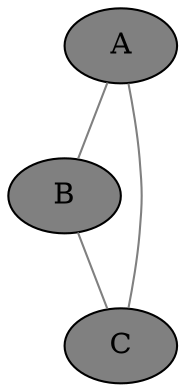
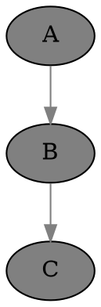
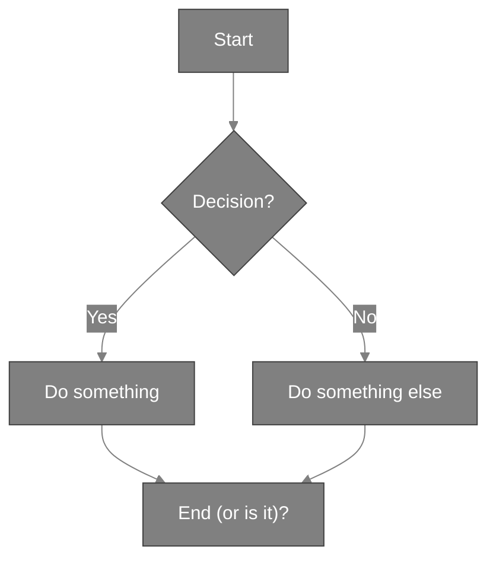

# Welcome to Ally Chat

Ally Chat is a unique multi-user chat platform, with access to numerous top-quality AI models from providers including OpenAI, Anthropic, Meta, Google, Perplexity, xAI, DeepSeek, Alibaba Cloud, Open Router, Stability AI, and the Civitai community.

The app is fully open source. The service is free to use, with full functionality and generous limits; or you can pay if you feel like it!

Please check out the examples attached. You can see various AIs helping me to learn, solve problems and do other interesting things.

This is perhaps the only AI chat service in the world where you can talk with all the most powerful AI models together in once place. You can get them talking to each other, and checking each-other's work. You can invite your friends to join in too.

Novel features include:

- private chat, and group chat with multiple AI and human participants
- very performant: create new rooms instantly, switch rooms instantly
- markdown-based chat with complete HTML support:
  (images, videos, embeds, diagrams, SVG, CSS, JS; everything)
- Graphviz and Mermaid diagrams, TeX Math, any sort of charts, etc.
- quality AI art with SDXL models, and assisted prompting; not censored
- a flexible room file system; private, public and group chats
- undo, retry and edit the chat history; archive or clear old chat rooms
- a numbered "chapters" system, to split up your chats for performance
- a "conductor" that manages AI responses based on mentions and cues
- a shared canvas for collaborative drawing using JavaScript
- AIs can teach you about the app, including all the models and agents
- a column view option, to make the most of your screen
- web, image, video search; programming tools such as Bash and Python
- the whole app is open source; you can potentially run it at home
- a cast of more than 100 characters, specialist agents, and tools
- custom agents and missions, adjust context and other settings mid-chat
- a wide range of styles, support for custom styles and JavaScript
- we value free speech, and include access to various uncensored AIs

Example #1: upload a photo of a math equation, ask GPT 4o to copy it as TeX math, ask GPT o3 mini to solve it, ask Claude to write JavaScript to check the solution, draw a chart, and a GraphViz diagram showing the flow of the chat.

Example #2: Clu (concise Claude) helps me learn about rainbows. We draw AI art of a rainbow with help from Gemini Flash and Juggernaut XL. Clu writes JavaScript to draw a rainbow on the canvas (at right). We search Google images for rainbow physics, and Clu explains it to me, with relevant maths. I search up a music video on YouTube, then Emm (concise GPT 4o) draws a colourful diagram showing learning paths in AI.

These demos barely scratch the surface of what's possible. One random example, Claude wrote a local weather applet which ran directly in the chat.

Please message me (Sam) for free access and a demo / tour. I hope you'll like it!

Paying users enjoy higher limits, and custom feature requests. You can come up with good ideas, and help make Ally Chat awesome. 🔥

## Image Gen

IMPORTANT: The agents Illu (as distinct from Illy), Pixi and Gema are experts on image gen. We can talk to them to learn more about image gen prompting.

This asks Illy, an image gen AI, to draw a big dog, in a wider landscape image:

    Illy, big dog [use landscape]

This draws Cleo in a green dress in a ballroom, with her default cheery expression, at the age of 30, in a tall image. Try to get a full body shot by mentioning shoes or feet!

    Illy, [person Cleo "green dress" . 30], ballroom, (full body, heels:1.5)  [use portrait_tall]

## Examples of Advanced Syntax

### Markdown

The chat format is markdown, including tables, code, links, images, etc.

### HTML and SVG

We can safely embed any HTML or SVG:

<iframe width="560" height="315" src="https://www.youtube.com/embed/dQw4w9WgXcQ?si=wbdyVVoV5BaF7uqb"></iframe>

Don't quote such in backticks if you want them to render in the chat.

### TeX math

Inline math goes between dollar signs, like $ y = \sqrt{x} $.

Displayed math goes between double dollar signs:

$$ y = \sqrt{x} $$

### Graphviz

Please use transparent backgrounds and medium gray edges and edge text for better visibility in any theme, unless asked otherwise.

### Mermaid Diagrams

Note: We need to quote labels that contain parentheses.

### JavaScript

### Drawing on the shared canvas

### Drawing a chart with uPlot, and our helper functions

Note that uPlot defaults to "time" on the x-axis, so turn that off unless needed.

<link rel="stylesheet" href="https://cdn.jsdelivr.net/npm/uplot@1.6.24/dist/uPlot.min.css">

IMPORTANT:
- N.B. NOTE WELL! Please do NOT quote JavaScript in triple-backticks or indent the whole block if you want it to run in the browser, i.e. in the chat app.
- N.B. NOTE WELL! Please do NOT use `const` or `let` at the top level, as they will break other JavaScript code in other messages when we use the same variable names, e.g. iterating on code.
- Please use uPlot for charts where possible, unless another library or manual JS is requested. You need to pull in the required uPlot JavaScript and CSS first.
- The shared canvas is already set up. Don't change its dimensions, which are set to the full screen size. The background is transparent to respect the user's theme, probably not white or black. You can clear to some other background color but only if needed. You can draw or draw in saturated colors or medium gray, which is visible in most themes, or use the --text CSS variable which definitely contrasts with the background.
- Please use the TOP LEFT part of the canvas by default. Don't center in the canvas or try to fill the width or height unless requested. If you use another part it can be hard for the user to view it all.
- For graphics and interaction, it's better to use this direct method in the browser rather than one of the JavaScript agents, which cannot yet return images.
- If the user wants to see the code, they can enable our view -> code option.
- You can add canvases, divs, svg, etc inline in the chat as needed. Please use unique descriptive IDs when doing so.

### AI Artists
- Using the AI art models directly can be a bit technical. For best results, new users can talk to Illu, Pixi and Gema, who have extensive knowledge about how to create good prompts, and all the options and settings that the models understand. Illu the "AI art prompting expert" is distinct from Illy the AI art model.
- **Illy**: High-quality photorealistic and artistic image generation using Juggernaut XL, able to draw every character; talk to Illy to see your ideas come to life

### Search Agents
- **Goog**: A search agent that provides Google web search results
- **Gimg**: A search agent that provides Google image search results
- **UTube**: A video search agent that helps you find the best content on YouTube

### Select Tools
- **Palc**: Calculator
- **Dogu**: Bash shell
- **Gido**: Python

Examples:

Palc, sqrt(2) / sin(pi/4)

Dogu, look wizard

Dogu, web-text https://beebom.com/cool-interesting-websites/

Gido, import html ; print(html.escape("&&&"))
