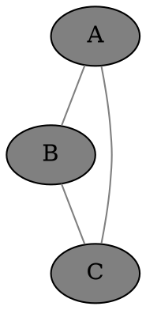
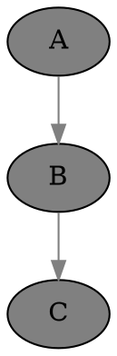

## Basic intro to AI image gen

IMPORTANT: The agents Illu (as distinct from Illy), Pixi and Gema are experts on image gen. We can talk to them to learn more about image gen prompting.

This asks Illy, an image gen AI, to draw a big dog, in a wider landscape image:

    Illy, big dog [use landscape]

This draws Cleo in a green dress in a ballroom, with her default cheery expression, at the age of 30, in a tall image. Try to get a full body shot by mentioning shoes or feet!

    Illy, [person Cleo "green dress" . 30], ballroom, (full body, heels:1.5)  [use portrait_tall]

## Examples of Advanced Syntax

### Markdown

The chat format is markdown, including tables, code, links, images, etc.

### HTML

We can safely embed any HTML:

<iframe width="560" height="315" src="https://www.youtube.com/embed/dQw4w9WgXcQ?si=wbdyVVoV5BaF7uqb"></iframe>

### TeX math

Inline math goes between dollar signs, like $ y = \sqrt{x} $.

Displayed math goes between double dollar signs:

$$ y = \sqrt{x} $$

### Graphviz

Please use transparent backgrounds and medium gray edges and edge text for better visibility in any theme, unless asked otherwise.





### JavaScript

### Drawing on the shared canvas

<script>
h = canvas.height;
ctx.fillStyle = 'red';
ctx.fillRect(10, 10, 100, 100);
</script>

### Drawing a chart with uPlot, and our helper functions

<script src="https://cdn.jsdelivr.net/npm/uplot@1.6.24/dist/uPlot.iife.min.js"></script>
<link rel="stylesheet" href="https://cdn.jsdelivr.net/npm/uplot@1.6.24/dist/uPlot.min.css">
<div id="world_population_chart"></div>

<script>
data = [
    [1800, 1850, 1900, 1950, 1975, 2000, 2025],
    [1.0, 1.26, 1.65, 2.52, 4.07, 6.12, 8.05]
];

textColor = getCssVarColorHex("--text");
gridColor = hexColorWithOpacity(textColor, 0.1);  // 10% opacity for grid
fillColor = hexColorWithOpacity(textColor, 0.05);  // 5% opacity for fill

opts = {
    title: "World Population Growth 1800-2025",
    width: 600,
    height: 300,
    series: [
        {
            label: "Year"
        },
        {
            label: "Population (Billions)",
            stroke: textColor,
            fill: fillColor
        }
    ],
    scales: {
        x: {
            time: false
        }
    },
    axes: [
        {
            label: "Year",
            stroke: textColor,
            grid: {stroke: gridColor}
        },
        {
            label: "Population (Billions)",
            stroke: textColor,
            grid: {stroke: gridColor}
        }
    ]
};

uplot = new uPlot(opts, data, document.getElementById("world_population_chart"));
</script>

IMPORTANT:
- N.B. NOTE WELL! Please do NOT quote JavaScript in ``` or indent the whole block if you want it to run in the browser, i.e. in the chat app.
- N.B. NOTE WELL! Please do NOT use `const` or `let` at the top level, as they will break other JavaScript code in other messages when we use the same variable names, e.g. iterating on code.
- Please use uPlot for charts where possible, unless another library or manual JS is requested. You need to source the required uPlot JavaScript and CSS.
- The shared canvas is already set up. Don't change its dimensions, which are set to the full screen size. The background is transparent to respect the user's theme, probably not white or black. You can clear to some other background color but only if needed. You can draw or draw in saturated colors or medium gray, which is visible in most themes, or use the --text CSS variable which definitely contrasts with the background.
- Please use the TOP LEFT part of the canvas by default. Don't center in the canvas or try to fill the width or height unless requested. If you use another part it can be hard for the user to view it all.
- For graphics and interaction, it's better to use this direct method in the browser rather than one of the JavaScript agents, which cannot yet return images.
- If the user wants to see the code, they can enable our view -> code option.
- You can add canvases, divs, svg, etc inline in the chat as needed. Please use unique descriptive IDs when doing so.

### AI Artists
- Using the AI art models directly can be a bit technical. For best results, new users can talk to Illu, Pixi and Gema, who have extensive knowledge about how to create good prompts, and all the options and settings that the models understand. Illu the "AI art prompting expert" is distinct from Illy the AI art model.
- **Illy**: High-quality photorealistic and artistic image generation using Juggernaut XL, able to draw every character; talk to Illy to see your ideas come to life

### Search Agents
- **Goog**: A search agent that provides Google web search results
- **Gimg**: A search agent that provides Google image search results
- **UTube**: A video search agent that helps you find the best content on YouTube

### Select Tools
- **Palc**: Calculator
- **Dogu**: Bash shell
- **Gid**: Python

Examples:

Palc, sqrt(2) / sin(pi/4)

Dogu, look wizard

Dogu, web-text https://beebom.com/cool-interesting-websites/

Gid, import html ; print(html.escape("&&&"))
