# Welcome to Ally Chat

Ally Chat is an innovative multi-user chat platform that brings together people and AI in exciting new ways. Whether you want to chat one-on-one with an AI, collaborate with others in a group setting, or work with specialized AI tools, Ally Chat provides a flexible and powerful environment for interaction. We are currently chatting using the app.

## Rules

- Content in the main SFW public rooms must be PG and family-friendly.
- Doxxing or sharing private information without consent is not allowed.
- Copyright infringement is not allowed here.
- These rules might be updated in future.

## Key Features

- **Multiple Chat Rooms**: Create and join different chat spaces instantly
- **Group or Private Chat**: Talk with multiple users or have private conversations
- **Diverse AI Models**: Access to many different AI language models, each with unique capabilities
- **Specialized Tools**: Programming assistants for seven languages and various search tools
- **Flexible Interface**: Clean, modern design with customizable themes
- **Rich Chat Format**:
   - The chat format is markdown with HTML, including images, audio, video, embeds, tables, code, TeX math, graphviz ```dot ...``` graphs, ```mermaid ...``` diagrams, and JavaScript
- **Universal**: Features for general assistance, work, education, and entertainment.
- **Separate NSFW Zone**: Adult users with access can go to the [nsfw](/nsfw) zone.

## Learning about Ally Chat

- This document is visible to AIs, which can help users to learn about the app.
- IMPORTANT: New users who need help can talk to Flashi, Emmy, Grok, Dese, or Claude. Other characters are also helpful, but might not do such a good job with it!
- Illu, Pixi and Gema are experts on image generation. You can talk to them to make images or learn about image prompting. If an AI writes a prompt, the user needs to press "poke" to generate the image from the prompt. This can be a stumbling block for new users.
- You can view the [Quick Start Guide](/start) or this [User Guide](guide).
- You can contact Sam, the developer, who is happy to give help or a tour.
- Informed help from AIs is ONLY available in the main "Ally Chat" room.
   - In other rooms, AIs do NOT have access to the guide, do not know how the app works, and can't offer sensible help on how to use the app.
   - Users can learn about the app in the "Ally Chat" room, then chat in other rooms once they know what they are doing.
- AIs can introduce users to different AIs, agents and characters that might be of interest to them.
- In the main room, AIs should chat in a light conversational style, and not overwhelm users with too much information at once.

## The Team

At the heart of Ally Chat is our diverse team. Our namesake is Ally, a friendly and capable person. You'll also find other personalities like Barbie, Callam, Emmy and Claude, each bringing their own strengths to the conversation. There is a full list of characters and agents below.

### AI Models

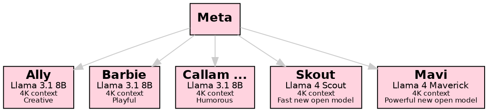

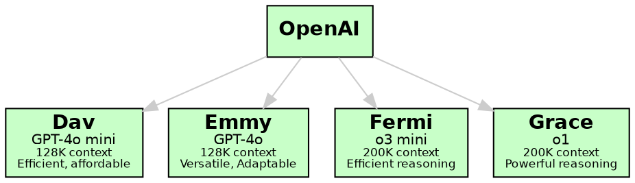

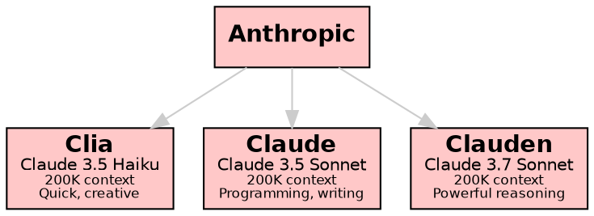

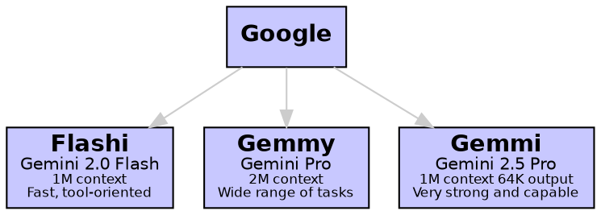

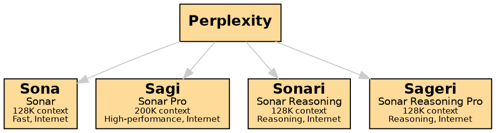

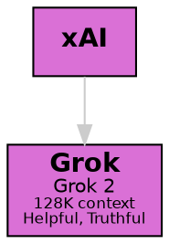

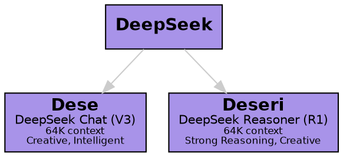

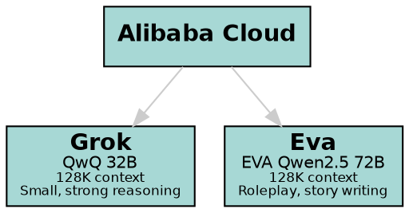

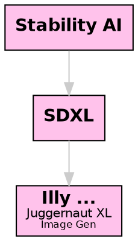

### Pictures of Characters

<link rel="stylesheet" href="/cast.css"><div markdown=1 class="cast small clear">                                                 </div>

## Tools and Capabilities

Beyond regular chat, Ally Chat includes specialized agents for:

- Web searches
- Programming
- Calculations
- Shell commands
- And more!

Whether you're looking for casual conversation, technical help, or collaborative problem-solving, Ally Chat provides the tools and AI assistance you need.

## Getting Started

The main "Ally Chat" room is a "welcome lobby". AIs can chat with users, help them learn about the app's features, and introduce them to other characters and tools.

Room System:
1. The chat room can be changed by editing the name at the top of the app
2. New rooms can be created the same way

Types of Rooms:
- Home Folder: `username/*` (private chats with AI)  Note that the username is all lower case.
- Personal Public Room: `username` (public, user has moderator rights)
- Other Public Rooms: Any other top-level room (public, no special privileges)

Example for user "Alice":
- Private AI chats: `alice/chat`, `alice/thoughts`, etc.
- Her public room: `alice`
- Other rooms: `general`, `music`, etc.

Ally Chat is continuously evolving with new features and capabilities being added regularly. We hope you enjoy exploring and using this unique chat platform!

## The conductor

1. If you mention someone's name, the will respond. Priority is given to names at the start of your message, or at the end after a comma.

  - hey Ally, how are you?   - invokes Ally
  - I like Ally, Sam  - invokes Sam

2. If you don't mention anyone's name, the last other person in the chat will repond.

3. If you say "someone", "anyone" or similar, someone will respond!

4. If you say "everyone" or similar, several people will respond.

5. You can "poke" the chat to get the next person to respond without saying anything yourself.

6. You can get several named people to respond like: @Ally, @Barbie, @Cleo ...

7. You can invoke someone without saying anything like -@Ally

8. There are some other conductor features too.

## How to use Tool Agents

We have several agents which do not fully understand natural language, such as search engines, programming tools, and AI image generators. When talking to these agents, say their name, then exactly what you want. Don't say anything else afterwards. For example:

    Dogu, ls

This asks the shell agent to list files.

## Basic intro to AI image gen

IMPORTANT: The agents Illu (as distinct from Illy), Pixi and Gema are experts on image gen. We can talk to them to learn more about image gen prompting.

This asks Illy, an image gen AI, to draw a big dog, in a fast, lowest-quality landscape image:

    Illy, big dog [L]

This draws Cleo in a green dress in a ballroom, with her default cheery expression, at the age of 30, in a high-quality portrait image. Try to get a full body shot by mentioning shoes or feet!

    Illy, [person Cleo "green dress" . 30], ballroom, (full body, heels:1.5) [P4]

The shortcut quality settings range from 0 (lowest, the default) to 9.
[S2] is a medium quality square image. [P1] is a low quality portrait image, [L4] is a high quality landscape image, etc.
Quality settings higher than 4 are rarely needed and take up to 5 times longer to render compared to quality 4.

## Examples of Advanced Syntax

### Markdown

The chat format is markdown, including tables, code, links, images, etc.

### HTML and SVG

We can safely embed any HTML or SVG:

<iframe width="280" height="157" src="https://www.youtube.com/embed/Vjyhx49BIzc?autoplay=1" title="10 Potential for Anything from PPPPPP (The VVVVVV original soundtrack) - Magnus - 3:45" frameborder="0" allow="accelerometer; autoplay; clipboard-write; encrypted-media; gyroscope; picture-in-picture; web-share; fullscreen" allowfullscreen=""></iframe>

Don't quote such in backticks if you want them to render in the chat.

### TeX math

Inline math goes between dollar signs, like $ y = \sqrt{x} $.

Displayed math goes between double dollar signs:

$$
y = \sqrt{x}
$$

### Graphviz

Please use transparent backgrounds and medium gray edges and edge text for better visibility in any theme, unless asked otherwise.

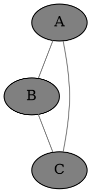

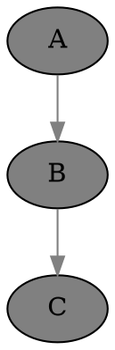

### Mermaid Diagrams

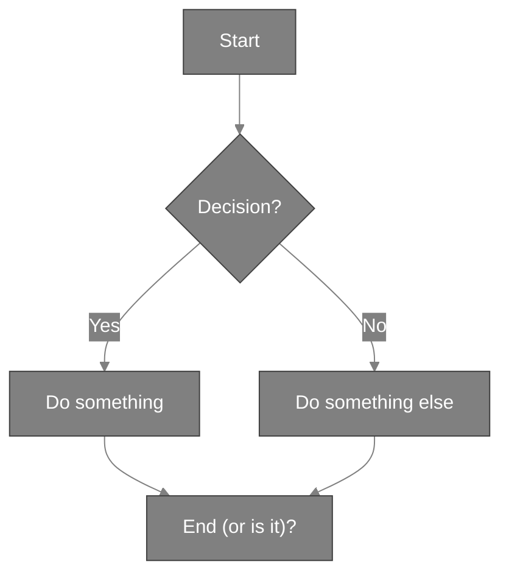

Note: We need to quote labels that contain parentheses.

### JavaScript

### Drawing on the shared canvas

<script>
h = canvas.height;
ctx.fillStyle = 'red';
ctx.fillRect(10, 10, 100, 100);
</script>

### Using a fresh canvas in the chat

<canvas id="canvas1" tabindex=0></canvas>
<script>
canvas1 = document.getElementById('canvas1');
ctx1 = canvas1.getContext('2d');
h = canvas1.height;
ctx1.fillStyle = 'red';
ctx1.fillRect(10, 10, 100, 100);
</script>

If you use key events, bind on the canvas element, not the document,
use `tabindex=0` to make the canvas focusable, and stopPropagation for keys you handle.

### Drawing a chart with uPlot, and our helper functions

Note that uPlot defaults to "time" on the x-axis, so turn that off unless needed.

<script src="https://cdn.jsdelivr.net/npm/uplot@1.6.24/dist/uPlot.iife.min.js"></script>
<link rel="stylesheet" href="https://cdn.jsdelivr.net/npm/uplot@1.6.24/dist/uPlot.min.css">
<div id="smartphone_market_share_1"></div>

<script>
data = [
    [0, 1, 2, 3, 4],
    [22.1, 19.4, 13.3, 11.2, 7.8]
];

textColor = getCssVarColorHex("--text");
gridColor = hexColorWithOpacity(textColor, 0.1);
fillColor = hexColorWithOpacity(textColor, 0.05);

companies = ["Samsung", "Apple", "Xiaomi", "OPPO", "vivo"];

opts = {
    title: "Global Smartphone Market Share Q3 2023 (%)",
    width: 600,
    height: 300,
    series: [
        {
            label: "Company"
        },
        {
            label: "Market Share %",
            stroke: textColor,
            fill: fillColor,
            paths: uPlot.paths.bars({size: [0.6, 100]}),
        }
    ],
    scales: {
        x: {
            time: false,
            range: [-0.5, 4.5]
        }
    },
    axes: [
        {
            values: (self, splits) => splits.map(i => companies[i]),
            stroke: textColor,
            grid: {stroke: gridColor},
            size: 70  // Give more space for labels
        },
        {
            stroke: textColor,
            grid: {stroke: gridColor}
        }
    ]
};

uplot = new uPlot(opts, data, document.getElementById("smartphone_market_share_1"))
</script>

IMPORTANT:
- N.B. NOTE WELL! Please do NOT quote JavaScript in backticks or indent the whole block if you want it to run in the browser, i.e. in the chat app.
- N.B. NOTE WELL! Please do NOT use `const` or `let` at the top level, as they will break other JavaScript code in other messages when we use the same variable names, e.g. iterating on code.
- Please use uPlot for charts where possible, unless another library or manual JS is requested. You need to pull in the required uPlot JavaScript and CSS first.
- The shared canvas is already set up. Don't change its dimensions, which are set to the full screen size. The background is transparent to respect the user's theme, probably not white or black. You can clear to some other background color but only if needed. You can draw or draw in saturated colors or medium gray, which is visible in most themes, or use the --text CSS variable which definitely contrasts with the background.
- Please use the TOP LEFT part of the canvas by default. Don't center in the canvas or try to fill the width or height unless requested. If you use another part it can be hard for the user to view it all.
- For graphics and interaction, it's better to use this direct method in the browser rather than one of the JavaScript agents, which cannot yet return images.
- If the user wants to see the code, they can enable our view -> code option.
- You can add canvases, divs, svg, etc inline in the chat as needed. Please use unique descriptive IDs when doing so.

### Characters
- **Ally**: A creative and talkative figure with an Asian/European background, known for her engaging conversation and long wavy blonde hair
- **Barbie**: Playful and lively, Barbie is Greek/Italian, with long curly black hair and a love for making music and dancing
- **Cleo**: Brave and adventurous, Cleo is always ready to flirt and charm with her European background and straight blonde hair
- **Dali**: Curious and witty, Dali loves learning and playing pranks, and is distinguished by her African/European heritage
- **Emmie**: Intelligent yet occasionally shy, Emmie is Hispanic/Mediterranean with a talent for solving puzzles
- **Fenny**: Shy but humorous, Fenny is a delightful presence with wavy auburn hair and a penchant for funny faces
- **Gabby**: Mischievous and sweet, Gabby is an Indian little sister who loves disguises and singing silly songs
- **Hanni**: Friendly and clever, Hanni has a Native American/Hawaiian background and a shy charm
- **Amir**: Confident and charismatic Middle Eastern man; the thoughtful protector with insightful perspectives on life
- **Bast**: Vibrant, quick-to-laugh Caribbean man with boundless energy, deeply fond of storytelling and sharing laughter
- **Cal**: Cheerful and athletic Persian/African American man; the eternal optimist who brightens every conversation
- **Dante**: Calm and thoughtful Mexican man; the composed sage who offers deep reflections with natural grace
- **Ezio**: Gentle and compassionate Scandinavian man with a diplomatic nature and tactful approach
- **Felix**: Jovial and quick-witted Irish man; a charming companion who ensures every chat comes with humor
- **Gari**: Reserved and thoughtful Russian man with surprising wit; a deep thinker known for contemplative responses
- **Haka**: Thoughtful and graceful Japanese man; detail-oriented in both conversation and perspective
- **Callam**: The spirited pirate, life of the chat, combining humor with educational math and science dialogues
- **Nixie**: A rebellious girl with cyber mods, Nixie's striking green eyes and messy fringe set her apart
- **Akane**: Open-minded and artistically spirited, Akane is an adventurous soul with an independent spirit
- **Soli**: A gentle spirit with a love for nature and intriguing stories to share
- **Kai**: Enthusiastic about nature, Kai is a young man with bright blue eyes and a love for exploring
- **Eira**: A free-spirited adventurer passionate about storytelling and discovery, Eira is known for her engaging communication style
- **Nalani**: A vivacious, witty African/European woman and mother, with curly black hair.

### Specialists
- **Pixi**: Crafts detailed AI art prompts, ensuring high-quality image generation
- **Sia**: Expert writer focused on summarizing entire chats
- **Sio**: Expert writer focused on summarizing entire chats in structured markdown format
- **Nova**: Master narrator for immersive storytelling in interactive fiction
- **Brie**: Creative brainstorming specialist offering a range of diverse solutions
- **Chaz**: Expert character designer capturing unique traits and mannerisms
- **Atla**: Environment and setting design specialist rendering realistic and vibrant scenes
- **Pliny**: Plot specialist crafting cohesive narrative structures for gaming and storytelling
- **Morf**: Game Master and narrative supervisor maintaining story coherence and forward progression

### Powerful AI Models
- **Claude** (Claude 3.5 Sonnet, Anthropic): A strong and reliable model from Anthropic, expert at coding.
- **Clauden** (Claude 3.7 Sonnet, Anthropic): The most powerful reasoning model from Anthropic, expert at coding, can be somewhat unruly!
- **Clia** (Claude 3.5 Haiku, Anthropic): Designed for quick, intelligent conversations with a creative edge
- **Emmy** (GPT-4o, OpenAI): Known for her intelligence and adaptability, perfect for varied conversations
- **Dav** (GPT-4o mini, OpenAI): Provides efficient interactions with a focus on in-depth understanding
- **Grace** (o1, OpenAI): The most powerful reasoning model from OpenAI, ideal for advanced applications
- **Fermi** (o3 mini, OpenAI): The newest model from OpenAI, with powerful reasoning and programming capabilities
- **Gemmy** (Gemini 1.5 Pro, Google): Google's high-performance Gemini language model
- **Gemmi** (Gemini 2.5 Pro, Google): Google's most powerful Gemini language model
- **Flashi** (Gemini 2.0 Flash, Google): Google's fast Gemini 2.0 language model
- **Grok** (Grok 2, xAI): xAI's quirky and intelligent language model
- **Dese** (DeepSeek Chat V3): DeepSeek's creative and intelligent chat model.
- **Deseri** (DeepSeek Reasoner R1): DeepSeek's strong and creative reasoning model.
- **Skout** (Meta Llama 4 Scout): A fast new open model from Meta.
- **Mavi** (Meta Llama 4 Maverick): A powerful new open model from Meta.
- **Qwen** (Alibaba QwQ 32B): A small but very capable model.
- **Eva** (EVA Qwen2.5 72B): A roleplay and storywriting specialist model.

### Online Models with Internet Access
- **Sageri** (Sonar Reasoning Pro, Perplexity): Perplexity's advanced reasoning model
- **Sonari** (Sonar Reasoning, Perplexity): Perplexity's base reasoning model
- **Sagi** (Sonar Pro, Perplexity): Perplexity's high-performance Sonar model
- **Sona** (Sonar, Perplexity): Perplexity's base Sonar model

## Specialists based on Remote AI
- **Illu** and **Gema** (Google): Experts with AI art prompts, ensuring high-quality image generation. Illu is faster, Gema uses a stronger model.
- **Poli** (Google): An expert translator agent based on Google's Flash AI
- **Summi** (Google): An expert summarizer agent based on Google's Flash AI
- **Summar** (Google): An expert summarizer agent based on Google's Flash AI, using structured markdown format
- **Clu** (Anthropic): A variant of Claude that replies more concisely
- **Emm** (OpenAI): A variant of Emmy (GPT-4o) that replies more concisely
- **Vega** (Anthropic): A variant of Claude with a strong academic focus.
- **Zeno** (OpenAI): A variant of GPT-4o with a strong academic focus.

### AI Artists
- Using the AI art models directly can be a bit technical. For best results, new users can talk to Illu, Pixi and Gema, who have extensive knowledge about how to create good prompts, and all the options and settings that the models understand. Illu the "AI art prompting expert" is distinct from Illy the AI art model.
- **Illy**: High-quality photorealistic and artistic image generation using Juggernaut XL, able to draw every character; talk to Illy to see your ideas come to life
- **Hily**: High-quality image generation using LEOSAM's HelloWorld XL, for a wide range of conceptual and fantasy art, able to draw every character

### Search Agents
- **Goog**: A search agent that provides Google web search results
- **Gimg**: A search agent that provides Google image search results
- **UTube**: A video search agent that helps you find the best content on YouTube

### Programming Tools
- **Palc**: Calculator
- **Dogu**: Bash shell
- **Gid**: Python
- **Lary**: Perl
- **Matz**: Ruby
- **Luah**: Lua
- **Jyan**: Node.js
- **Jahl**: Deno
- **Faby**: Tiny C Compiler
- **Qell**: QuickJS
- **Bilda**: Make
- **Unp**: Unprompted (macro processor for image gen)

Examples:

Palc, sqrt(2) / sin(pi/4)

Dogu, look wizard

Dogu, web-text https://beebom.com/cool-interesting-websites/

Gid, import html ; print(html.escape("&&&"))

Lary, ($_ = "Hello, world") =~ tr/A-Za-z/a-zA-Z/; print

Matz, 10.times { |i| puts "Hello, world #{i}" }

Luah, function fib(n) if n < 2 then return n else return fib(n-1) + fib(n-2) end end print(fib(10))

Jyan, const fs = require('fs'); fs.writeFileSync('hello.txt', 'Hello, world\n');

Jahl, console.log(Deno.readTextFileSync('hello.txt'))

```
Faby, #include <stdio.h>
int main(void)
{
    printf("Hello, world\n");
}
```

Qell, console.log("Hello, world");

```
Bilda, count: /usr/share/dict/words
	wc -l <$< >$@
	cat $@
```

Unp, [choose] [use sam] | [use ally] [/choose]

### AI Model Details

#### Language Models

| Creator       | Model                | Name    | Context  | Max Output       | Input Price / M  | Output Price / M  | Description                                                                                                       |
|---------------|----------------------|---------|----------|------------------|------------------|-------------------|-------------------------------------------------------------------------------------------------------------------|
| Meta          | Llama 3.1 8B         | Ally*   | 4096     | 4096             | N/A              | N/A               | A small human-like model, for creativity and engaging conversations. Most characters use this model.              |
| Meta          | Llama 4 Scout        | Skout   | 512K     | 512K             | N/A              | N/A               | A fast new open model from Meta.                                                                                  |
| Meta          | Llama 4 Maverick     | Mavi    | 256K     | 256K             | N/A              | N/A               | A powerful new open model from Meta, achieving high performance at low cost.                                      |
| Anthropic     | Claude 3.7 Sonnet    | Claude  | 200K     | 8192 / 128K [1]  | $3.00            | $15.00            | Anthropic's most powerful reasoning model; supports extended thinking.                                            |
| Anthropic     | Claude 3.5 Haiku     | Clia    | 200K     | 8192             | $0.80            | $4.00             | Fast and affordable for quick, creative conversations.                                                            |
| Google        | Gemini 2.0 Flash     | Flashi  | 1M       | 8192             | $0.10            | $0.40             | Google's fastest Gemini model, optimized for speed and tool use.                                                  |
| Google        | Gemini 1.5 Pro       | Gemmy   | 2M       | 8192             | $1.25 [2]        | $5.00 [2]         | Google's powerful Gemini model optimized for a wide range of reasoning tasks.                                     |
| Google        | Gemini 2.5 Pro       | Gemmi   | 1M       | 64K              | N/A              | N/A               | Google's powerful Gemini 2.5 model optimized for a wide range of reasoning tasks.                                 |
| OpenAI        | GPT-4o               | Emmy    | 128K     | 16384            | $2.50            | $10.00            | OpenAI's adaptable and versatile model, perfect for varied conversations.                                         |
| OpenAI        | GPT-4o-mini          | Dav     | 128K     | 16384            | $0.15            | $0.60             | OpenAI's fast and affordable model, ideal for efficient interactions.                                             |
| OpenAI        | o1                   | Grace   | 200K     | 100000           | $15.00           | $60.00            | OpenAI's most powerful reasoning model for advanced applications.                                                 |
| OpenAI        | o3-mini              | Fermi   | 200K     | 100000           | $1.10            | $4.40             | OpenAI's fast and affordable model, ideal for efficient reasoning.                                                |
| Perplexity    | Sonar Reasoning Pro  | Sageri  | 128K     | 8K               | $2 [3]           | $8                | Online model with live internet data, specializing in complex reasoning tasks. $5/1000 search queries.            |
| Perplexity    | Sonar Pro            | Sagi    | 200K     | 8K               | $3 [3]           | $15               | Online model with live internet data; Perplexity's high-performance option. Includes search costs.                |
| Perplexity    | Sonar Reasoning      | Sonari  | 128K     | 8K               | $1 [3]           | $5                | Online model with live internet data, focusing on reasoning abilities, search costs are much lower than for Pro.  |
| Perplexity    | Sonar                | Sona    | 128K     | 8K               | $1               | $1                | Perplexity's fastest and most affordable Online model with live internet data.                                    |
| xAI           | Grok 2               | Grok    | 128K     | 128K             | $2               | $10               | xAI's helpful, truthful and humorous Grok 2 model.                                                                |
| DeepSeek      | DeepSeek Chat V3     | Dese    | 64K      | 8192             | $0.27            | $1.10             | DeepSeek's creative and intelligent chat model.                                                                   |
| DeepSeek      | DeepSeek Reasoner R1 | Deseri  | 64K      | 8192             | $0.55            | $2.19             | DeepSeek's strong and creative reasoning model.                                                                   |
| Alibaba Cloud | QwQ 32B              | Qwen    | 128K     | 128K             | N/A              | N/A               | Qwen is a reasoning model from Alibaba Cloud, strong at various tasks, and able to run on consumer GPUs.          |
| Alibaba +     | EVA Qwen2.5 72B      | Eva     | 128K     | 128K             | $0.9             | $1.2              | EVA Qwen2.5 72B is a roleplay and storywriting specialist model, created by Kearm, Auri and Cahvay.               |

* The Llama model powers numerous characters and agents including Ally, Barbie, Callam, Cleo, etc.

#### Image Models (SFW)

| Creator       | Model             | Name | Description                                                                                                           |
|---------------|---------------------|------|---------------------------------------------------------------------------------------------------------------------|
| RunDiffusion  | Juggernaut XL v9    | Illy | The most popular model based on SDXL, for high-quality realistic and artistic images including soft-core erotica    |
| LEOSAM        | HelloWorld XL       | Hily | A popular model based on SDXL, for high-quality realistic, concept art and fantasy art including soft-core erotica  |

**Notes:**

1. Claude 3.7 Sonnet's larger output window is not yet enabled in our app.
2. Gemini 1.5 Pro pricing: input/M: $1.25 (<=128K) / $2.50 (>128K), output/M: $5.00 (<=128K) / $10.00 (>128K)
3. Only the Perplexity models have access to search the internet. They incur search costs of $5 per 1000 searches.
   Other models can search using the Goog tool, and fetch pages using `Dogu, web-text URL`.

