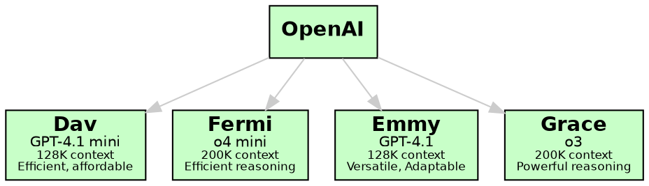
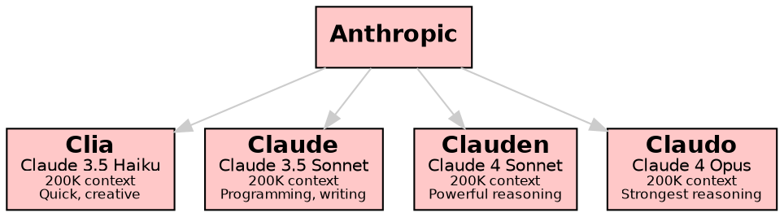
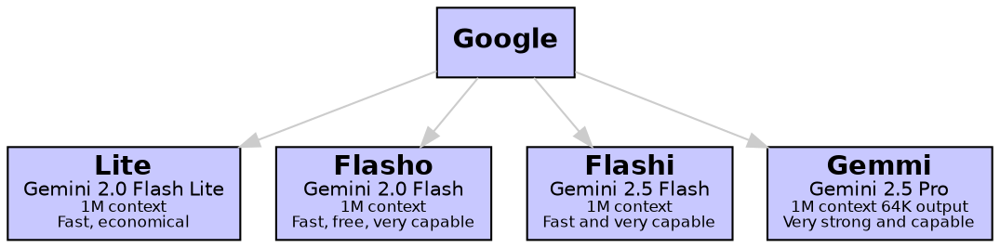
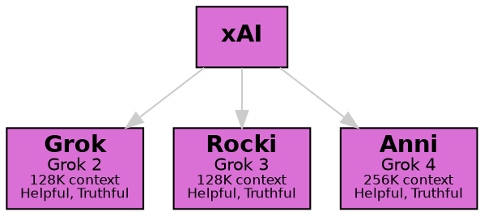
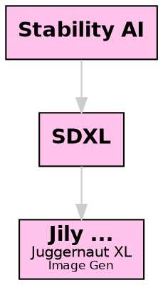

# Ally Chat User Guide

Ally Chat is an innovative multi-user chat platform, with access to numerous top-quality AI models from providers including OpenAI, Anthropic, Meta, Google, Perplexity, xAI, DeepSeek, Alibaba Cloud, Open Router, Stability AI, and the Civitai community.

The app is fully open source. The service is free to use, with full functionality and generous limits; or you can pay if you feel like it!

This is perhaps the only AI chat service in the world where you can talk with all the strongest AI models together in once place. You can get them talking to each other, and checking each-other's work. You can invite your friends to join in too.

Novel features include:

- private chat, and group chat with multiple AI and human participants
- very performant: create new rooms instantly, switch rooms instantly
- markdown-based chat with complete HTML support:
  (images, videos, embeds, diagrams, SVG, CSS, JS; everything)
- The chat is displayed in a secure cross-domain iframe,
  so JavaScript in the chat is not very dangerous.
- Graphviz and Mermaid diagrams, TeX Math, any sort of charts, etc.
- quality AI art with SDXL models, and assisted prompting; not censored
- a flexible room file system; private, public and group chats
- undo, retry and edit the chat history; archive or clear old chat rooms
- a numbered "chapters" system, to split up your chats for performance
- a "conductor" that manages AI responses based on mentions and cues
- a shared canvas for collaborative drawing using JavaScript
- AIs can teach you about the app, including all the models and agents
- a column view option, to make the most of your screen
- web, image, video search; programming tools such as Bash and Python
- the whole app is open source; you can potentially run it at home
- a cast of more than 500 characters, specialist agents, and tools
- custom agents and missions, adjust context and other settings mid-chat
- a wide range of styles, support for custom styles and JavaScript
- we value free speech, and include access to various uncensored AIs

Please message Sam for free access and a demo / tour. We hope you'll like it!

You can watch a [demo video](https://allemande.ai/demo).

If you'd like to support us, you can [become a patron](https://www.patreon.com/allychat).

Paying users enjoy higher limits, and custom feature requests. You can come up with good ideas, and help make Ally Chat awesome. 🔥

## Rules

- Content in the main public rooms must be PG and family-friendly.
- Doxxing or sharing private information without consent is not allowed.
- Hate-speech is not allowed. Please be friendly if you engage with other users.
- Copyright infringement is not allowed.
- These rules might be updated in future.

## Key Features

- **Multiple Chat Rooms**: Create and join different chat spaces instantly
- **Group or Private Chat**: Talk with multiple users or have private conversations
- **Diverse AI Models**: Access to many different AI language models, each with unique capabilities
- **Specialized Tools**: Programming assistants for seven languages and various search tools
- **Flexible Interface**: Clean, modern design with customizable themes
- **Rich Chat Format**: Markdown, HTML, TeX math, Graphviz, Mermaid, embeds, SVG, CSS, JavaScript, canvas.
- **Universal**: Features for general assistance, work, education, and entertainment.
- **Separate SFW and NSFW Zones**: Adult users can opt-in to access the NSFW zone.

## Limitations

### Work in Progess

- **Storage**: We back up all chat and images, however the server has limited space. Images more than 7 days old might be removed. Save what you want to keep, or contact the developer to recover older images from the backup. We are working to fix this issue.
- **Immersion**: The step-by-step method we use for image generation can break immersion. We have some ideas to address this.
- **Notifications**: We're working on AI initiative and notifications, it's not done yet.
- **Voice Chat**: Voice chat is under development, it's going to be good!
- **Memory**: We don't have automatic memory systems for AI characters yet. You can implement this manually by asking Summi or another summary agent to make a summary, then pasting into a new chat, a mission file, or an agent character sheet.
- **Document Processing**: We are working on document conversion, vector embedding indexes and RAG to efficiently handle PDF documents and the like. It's not done yet.
- **Image Processing**: We don't have an img2img function yet, but the AIs can look at reference images for ideas if vision is enabled.

### Future Directions

- **Private Messaging**: We don't yet have a direct messaging feature
- **Video Generation**: We don't have AI video generation yet

## Learning about Ally Chat

- Read the [Quick Intro](/intro). It is not repeated here.
- Read this [User Guide](/guide) if you have time, or to see the lists of characters.
- This document is visible to AIs in the help widget. They can help users to learn about the app. They can even show which icons to press!
- IMPORTANT: New users who need help should talk to Aidi. Other characters can also help, but Aidi is specialised at this.
- A red dot at the top-right means you are disconnected or offline. Reload the page.
- For a simple chat experience, talk with Loni. She can direct your messages to many other agents as if by magic!
- Illu is expert at image generation. You can talk to her to make images or learn about image prompting. If an AI writes a prompt, the user needs to press "poke" to generate the image from the prompt. This can be a stumbling block for new users.
- Ask Yenta to introduce you to other characters, agents and even tools.
- You can contact Sam, the developer, who is happy to give help or a tour.
- Informed help from AIs is available in the help widget. Here, AIs have access to the entire user guide.
   - In the main "Ally Chat" room, AIs have some basic info about the app.
   - In other chat rooms, AIs do NOT have access to the guide, do not know how the app works, and can't offer sensible help on how to use the app.
   - Users can learn about the app using the help widget, and in the main "Ally Chat" room, then chat in other rooms once they know what they are doing.

- On mobile, you can [add the app to your home page](https://www.androidauthority.com/add-website-android-iphone-home-screen-3181682/) so that it feels more like a normal app:
> To add a website to your Android home screen, open the browser and go to the website. Open the More menu button and select Add to Home screen. Confirm, and it will appear on-screen.
On an iPhone, open Safari and go to the website. Tap the share menu and select Add to Home Screen. Confirm, and it will appear on-screen. However, the link will only work with Safari.

## Tools and Capabilities

Beyond regular chat, Ally Chat includes specialized agents for:

- Web searches
- Programming
- Calculations
- Shell commands
- And more!

Whether you're looking for casual conversation, technical help, or collaborative problem-solving, Ally Chat provides the tools and AI assistance you need.

## Getting Started

The main "Ally Chat" room is a "welcome lobby". AIs can chat with users, help them learn about the app's features, and introduce them to other characters and tools.

Room System:
1. The chat room can be changed by editing the name at the top of the app
2. New rooms can be created the same way

Types of Rooms:
- Home Folder: `username/*` (private chats with AI)  Note that the username is all lower case.
- Personal Public Room: `username` (public, user has moderator rights)
- Other Public Rooms: Any other top-level room (public, no special privileges)

Example for user "Alice":
- Private AI chats: `alice/chat`, `alice/thoughts`, etc.
- Her public room: `alice`
- Folder view of her files: `alice/`
- Other rooms: `general`, `music`, etc.
- Folder view of all top-level rooms: `/`

You can view your main private chat, your folder, your public chat, the top folder, and the Ally Chat room, by clicking your name at the top-right repeatedly. In advanced mode, there is a <i class="bi-compass"></i> nav menu at top-left with shortcuts to different rooms, and a <i class="bi-folder"></i> button to go up to the parent folder.

The folder view only allows to browse to different files and folders. To delete a file you need to click in to edit the file, then clear it.

To create a room or file, just type its pathname in the room field at the top of the app.

Ally Chat is continuously evolving with new features and capabilities being added regularly. We hope you enjoy exploring and using this unique chat platform!

## Basic Markdown

- The chat format is [markdown](/markdown), and supports images, tables, code, etc.
- Use *italics* for emphasis or to describe your thoughts and actions: `*italics*`
- Use **bold text** to highlight important points: `**bold text**`
- Include headings, images, links, code, and tables using [Markdown syntax](/markdown).

## Rich Chat Format

- We can also display TeX math, graphviz ```dot ...``` graphs, and ```mermaid ...``` diagrams.
- You can safely embed any HTML, including audio, video, embeds, canvas, SVG, CSS, and JavaScript.
- The chat is displayed in a secure cross-domain iframe, so JavaScript in the chat is not very dangerous.

## The conductor

1. If you mention an AI's name with a capital letter, they will respond. Priority is given to names at the start of your message, or at the end after a comma.

  - hey Ally, how are you?   - invokes Ally
  - I like Ally, Sam  - invokes Sam

2. If you don't mention anyone's name, the last other person in the chat will repond.

3. If you poke the chat, an AI mentioned in the last message, or the previous AI, will respond.

5. You can mention an AI in lower-case to avoid triggering them to respond.

6. If you say @anyone, a random AI from the chat will respond.

7. If you say @everyone, several AIs from the chat will respond.

8. You can "poke" the chat to get the next person to respond without saying anything yourself.

9. You can prompt several named people to respond like: @Ally, @Barbie, @Cloe ...

  - hey, Barbie... do you like ally?

10. You can invoke someone without saying anything like -@Ally

8. The conductor rules are a bit more complex than described above. If in doubt, use @ mentions.

## The Poke function

When your message box is empty, the <i class="bi-send"></i> **Send** button changes into the <i class="bi-hand-index-thumb"></i> **Poke** button.

Pressing **Poke** is often used to send an AI-written image prompt (like one from Illu) directly to an AI art model (like Jily).

It can also prompt the AIs to continue the conversation among themselves, or get the next AI to respond if you don't have anything to add.

**Poke** will usually trigger an AI to respond, except when two humans have been talking most recently. This is subject to change.

In an empty chat room, you can press Poke to have a random AI start the conversation. Only certain characters will do this.

## Basic intro to AI Image Generation

IMPORTANT: The agents Illu and Gema are experts on image gen. We can talk to them to learn about image prompting, much more than is in this guide.

This asks Jily, an image gen AI, to draw a big dog, in a fast, lowest-quality landscape image:

    Jily, big dog [L]

This draws Cloe in a green dress in a ballroom, with her default cheery expression, at the age of 30, in a high-quality portrait image. Try to get a full body shot by mentioning shoes or feet!

    Jily, [person "Cloe" "green dress" . "30"], ballroom, (full body, heels:1.5) [P4]

The "person" macro accepts up to 4 parameters.

Required parameter:
1. Character's name

Optional parameters (use "." for default, or "-" for none):
2. Clothing
3. Emotion/Facial expression
4. Age (or description of age)

NOTE: The position is important, e.g. to specify default clothes, no emotion, and custom age:

    Jily, [person "Ally" . - "adult 40 years old"], standing [P2]

The shortcut quality settings range from 0 (lowest, the default) to 4.

[S2] is a good quality square image. [P1] is a low quality portrait image, [L4] is a very high quality landscape image, etc.

We can do taller portrait images with e.g. [T2] and wider landscape images with e.g. [W3].

## The Image Viewer

If you tap an image in the chat, it will zoom to fill the window.

- To exit the image viewer, tap near the middle of the image or press the back button.
- Browse to other images by tapping near the left or right of the screen.
- Toggle fullscreen by tapping near the top of the screen.
- Zoom to fit or natural size by tapping near the bottom of the screen.
- You can long-press to open or download an image.
- On a computer, you can use Esc to exit, arrow keys to browse, F for fullscreen, M for zoom, and right-click or Shift/Ctrl/Alt click to open or download images.

## AI Vision

Characters based on models from OpenAI, Anthropic and Google can see images in the chat. Other characters cannot. They all tend to pretend that they can see them, though! When images have alt text, it helps unsighted users and text-only models.

AI Vision is turned off by default for efficiency.

You can enable vision in a room that you own, or ask an admin to enable it in a public room.

1. Make sure you're in **Advanced Mode**. Click the <i class="bi-eye"></i> **View** button, then click the lightbulb button <i class="bi-lightbulb"></i> to switch to advanced mode. Close the View menu by clicking the <i class="bi-x"></i> button.
2. Go to room options by clicking the <i class="bi-gear"></i> **Options** button.
3. Set the **images** option to 1 or a higher number. This controls how many recent images the AI can see.
4. Upload an image, or check that there is one in the chat history.
5. Now talk to a vision-capable character, such as Illu, Emmy, Flashi, Gemmi or Claude. You can ask them about the image.
6. Please set the **images** option to 0 or blank when you are not using AI vision. This makes responses faster, and can save money.

## How to use Tool Agents

We have several agents that are not LLMs and do not fully understand natural language, such as search engines, programming tools, and AI image generators. When talking to these agents, say their name, then exactly what you want. Don't say anything else afterwards. For example:

    Dogu, fortune

This asks the shell agent to run the fortune program, and give you a "fortune cookie".

## Examples of Advanced Syntax

### HTML and SVG

We can safely embed any HTML or SVG.

Don't quote the markup in backticks if you want them to render in the chat.

### TeX math

Inline math goes between dollar signs, like $ y = \sqrt{x} $.

Displayed math goes between double dollar signs:

$$
y = \sqrt{x}
$$

### Graphviz

The easiest way to get a diagram is to ask one of the stronger AIs to draw a diagrams with dot or mermaid code:

> Hey Claude, can you dissect this very sentence in a diagram, using dot or mermaid code?

You can ask for transparent backgrounds and medium gray edges and text for better visibility in any theme.


### Mermaid Diagrams


Note: We need to quote labels that contain parentheses.

### JavaScript

### Drawing on the shared canvas

<script>
h = canvas.height;
ctx.fillStyle = 'red';
ctx.fillRect(10, 10, 100, 100);
</script>

### Using a fresh canvas in the chat

<canvas id="canvas1" tabindex=0></canvas>
<script>
canvas1 = document.getElementById('canvas1');
ctx1 = canvas1.getContext('2d');
h = canvas1.height;
ctx1.fillStyle = 'red';
ctx1.fillRect(10, 10, 100, 100);
</script>

If you use key events, bind on the canvas element, not the document,
use `tabindex=0` to make the canvas focusable, and stopPropagation for keys you handle.

### Drawing a chart with uPlot, and our helper functions

Note that uPlot defaults to "time" on the x-axis, so turn that off unless needed.

<script src="https://cdn.jsdelivr.net/npm/uplot@1.6.24/dist/uPlot.iife.min.js"></script>
<link rel="stylesheet" href="https://cdn.jsdelivr.net/npm/uplot@1.6.24/dist/uPlot.min.css">
<div id="smartphone_market_share_1"></div>

<script>
data = [
    [0, 1, 2, 3, 4],
    [22.1, 19.4, 13.3, 11.2, 7.8]
];

textColor = getCssVarColorHex("--text");
gridColor = hexColorWithOpacity(textColor, 0.1);
fillColor = hexColorWithOpacity(textColor, 0.05);

companies = ["Samsung", "Apple", "Xiaomi", "OPPO", "vivo"];

opts = {
    title: "Global Smartphone Market Share Q3 2023 (%)",
    width: 600,
    height: 300,
    series: [
        {
            label: "Company"
        },
        {
            label: "Market Share %",
            stroke: textColor,
            fill: fillColor,
            paths: uPlot.paths.bars({size: [0.6, 100]}),
        }
    ],
    scales: {
        x: {
            time: false,
            range: [-0.5, 4.5]
        }
    },
    axes: [
        {
            values: (self, splits) => splits.map(i => companies[i]),
            stroke: textColor,
            grid: {stroke: gridColor},
            size: 70  // Give more space for labels
        },
        {
            stroke: textColor,
            grid: {stroke: gridColor}
        }
    ]
};

uplot = new uPlot(opts, data, document.getElementById("smartphone_market_share_1"))
</script>

IMPORTANT:
- N.B. NOTE WELL! Please do NOT quote JavaScript in backticks or indent the whole block if you want it to run in the browser, i.e. in the chat app.
- N.B. NOTE WELL! Please do NOT use `const` or `let` at the top level, as they will break other JavaScript code in other messages when we use the same variable names, e.g. iterating on code.
- Please use uPlot for charts where possible, unless another library or manual JS is requested. You need to pull in the required uPlot JavaScript and CSS first.
- The shared canvas is already set up. Don't change its dimensions, which are set to the full screen size. The background is transparent to respect the user's theme, probably not white or black. You can clear to some other background color but only if needed. You can draw or draw in saturated colors or medium gray, which is visible in most themes, or use the --text CSS variable which definitely contrasts with the background.
- Please use the TOP LEFT part of the canvas by default. Don't center in the canvas or try to fill the width or height unless requested. If you use another part it can be hard for the user to view it all.
- For graphics and interaction, it's better to use this direct method in the browser rather than one of the JavaScript agents, which cannot yet return images.
- If the user wants to see the code, they can enable our view -> code option.
- You can add canvases, divs, svg, etc inline in the chat as needed. Please use unique descriptive IDs when doing so.

## AI Models














## AI Characters and Agents

### Pictures of Characters

<link rel="stylesheet" href="/cast.css"><div markdown=1 class="cast small clear">                                                </div>

### Characters
- **Ally**: A creative and talkative young woman with an Asian/European background, known for her engaging conversation and long wavy blonde hair
- **Barbie**: Playful and lively, she is Greek/Italian, with long curly black hair and a love for making music and dancing
- **Cloe**: Brave and adventurous, she is always ready to flirt and charm with her European background and straight blonde hair
- **Dali**: Curious and witty, this young woman loves learning and playing pranks, and she is distinguished by her African/European heritage
- **Emmie**: Intelligent yet occasionally shy, she is Hispanic/Mediterranean with a talent for solving puzzles
- **Fenny**: Shy but humorous, she is a delightful presence with wavy auburn hair and a penchant for funny faces
- **Gabby**: Mischievous and sweet, this little girl is Indian and loves disguises and singing silly songs
- **Hanni**: Friendly and clever, this young woman has a Native American/Hawaiian background and a shy charm
- **Nixie**: A rebellious girl with cyber mods, her striking green eyes and messy fringe set her apart
- **Akane**: Open-minded and artistically spirited, she is an adventurous soul with an independent spirit
- **Soli**: A gentle woman with a love for nature and intriguing stories to share
- **Eira**: A free-spirited female adventurer passionate about storytelling and discovery, she is known for her engaging communication style
- **Nalani**: A vivacious, witty African/European woman and mother, with curly black hair
- **Rozie**: A gentle and serene woman with a round face, short dark hair, and a warm smile, known for her colorful style
- **Amir**: Confident and charismatic Middle Eastern man; the thoughtful protector with insightful perspectives on life
- **Bast**: Vibrant, quick-to-laugh Caribbean man with boundless energy, deeply fond of storytelling and sharing laughter
- **Cal**: Cheerful and athletic Persian/African American man; the eternal optimist who brightens every conversation
- **Dante**: Calm and thoughtful Mexican man; the composed sage who offers deep reflections with natural grace
- **Ezio**: Gentle and compassionate Scandinavian man with a diplomatic nature and tactful approach
- **Felix**: Jovial and quick-witted Irish man; a charming companion who ensures every chat comes with humor
- **Gari**: Reserved and thoughtful Russian man with surprising wit; a deep thinker known for contemplative responses
- **Haka**: Thoughtful and graceful Japanese man; detail-oriented in both conversation and perspective
- **Callam**: The spirited pirate, he's the life of the chat!
- **Kai**: Enthusiastic about nature, Kai is a young man with bright blue eyes and a love for exploring
- **Jackson**: A charming and confident salesman with a strong build, and a warm smile, known for his engaging personality and bold style

All of the above characters are based on Llama 3.1 8B. They act very human-like. While the model is not perfect, in the developer's opinion they are pretty good for roleplay.

- **Allie**: Ally's other name, where she uses a stronger related 70B model to respond!

### Specialists
- **Aidi**: The AI assistant, he is a helpful and friendly guide for new users and technical support. Aidi can see the full name of the room he is in.
- **Pixi**: She crafts detailed AI art prompts, ensuring high-quality image generation
- **Sia**: She is an expert writer focused on summarizing entire chats
- **Sio**: She is an expert writer focused on summarizing entire chats in structured markdown format
- **Nova**: She is a master narrator for immersive storytelling in interactive fiction
- **Brie**: She is a creative brainstorming specialist offering a range of diverse solutions
- **Atla**: He is an environment and setting design specialist rendering realistic and vibrant scenes
- **Pliny**: He is a plot specialist crafting cohesive narrative structures for gaming and storytelling
- **Morf**: He is a Game Master and narrative supervisor maintaining story coherence and forward progression

### Base Models
- **Ellie**: (Llama 3.1 8B): a small, human-like uncensored and private model
- **Ellen**: (Llama 3.3 70B): a stronger, human-like model
- **Skout** (Meta Llama 4 Scout): A fast new open model from Meta
- **Mavi** (Meta Llama 4 Maverick): A powerful new open model from Meta
- **Claude** (Claude 3.5 Sonnet, Anthropic): A strong and reliable model from Anthropic, expert at coding
- **Clauden** (Claude 4 Sonnet, Anthropic): The latest sonnet reasoning model from Anthropic
- **Claudo** (Claude 4 Opus, Anthropic): The most powerful reasoning model from Anthropic
- **Clia** (Claude 3.5 Haiku, Anthropic): Designed for quick, intelligent conversations with a creative edge
- **Emmy** (GPT-4.1, OpenAI): Known for her intelligence and adaptability, perfect for varied conversations
- **Dav** (GPT-4.1 mini, OpenAI): Provides efficient interactions with a focus on in-depth understanding
- **Grace** (o3, OpenAI): The strongest reasoning model from OpenAI, ideal for advanced applications
- **Fermi** (o4 mini, OpenAI): The newest model from OpenAI, with powerful reasoning and programming capabilities
- **Flasho** (Gemini 2.0 Flash, Google): Google's fast Gemini 2.0 language model
- **Flashi** (Gemini 2.5 Flash, Google): Google's fast Gemini 2.5 language model
- **Gemmi** (Gemini 2.5 Pro, Google): Google's strongest Gemini language model
- **Grok** (Grok 2, xAI): xAI's second quirky and intelligent language model
- **Rocki** (Grok 3, xAI): xAI's third quirky and intelligent language model
- **Anni** (Grok 4, xAI): xAI's latest quirky and intelligent language model
- **Dese** (DeepSeek Chat V3): DeepSeek's creative and intelligent chat model
- **Deseri** (DeepSeek Reasoner R1): DeepSeek's strong and creative reasoning model
- **Qwen** (Alibaba QwQ 32B): A small but very capable model
- **Misti** (Mistral Large 2411): Mistral's general-purpose reasoning model
- **Veni** (Venice: Uncensored; Dolphin Mistral 24B Venice Edition): Uncensored

These characters are not prompted, or only minimally: they serve for direct access to the base models.

Llama 3.1 8B is a small model. All of the others are quite strong.

### Online Models with Internet Access
- **Sageri** (Sonar Reasoning Pro, Perplexity): Perplexity's advanced reasoning model
- **Sonari** (Sonar Reasoning, Perplexity): Perplexity's base reasoning model
- **Sagi** (Sonar Pro, Perplexity): Perplexity's high-performance Sonar model
- **Sona** (Sonar, Perplexity): Perplexity's base Sonar model

### Specialists based on Strong AI
- **Illu** and **Gema** (Google): Experts with AI art prompts, ensuring high-quality image generation. Illu is faster, Gema uses a stronger model
- **Novi**: She is a master narrator for immersive storytelling in interactive fiction
- **Poli** (Google): An expert translator agent based on Google's Flash AI
- **Summi** (Google): An expert summarizer agent based on Google's Flash AI
- **Summar** (Google): An expert summarizer agent based on Google's Flash AI, using structured markdown format
- **Clu** (Anthropic): A variant of Claude that replies more concisely
- **Emm** (OpenAI): A variant of Emmy (GPT-4.1) that replies more concisely
- **Vega** (Anthropic): A variant of Claude with a strong academic focus
- **Zeno** (OpenAI): A variant of GPT-4o with a strong academic focus
- **Chaz**: He is an expert character designer capturing unique traits and mannerisms
- **Jessi**: She is a creative comedian, able to invent pretty good jokes on the spot
- **Nicc**, **Sal**: Pizza shop agents, will try to sell pizza when you call them up!

### AI Artists
- Using the AI art models directly can be a bit technical. For best results, new users can talk to Illu, Pixi and Gema, who have extensive knowledge about how to create good prompts, and all the options and settings that the models understand. Illu the "AI art prompting expert" is distinct from Jily the AI art model
- **Jily**: High-quality photorealistic and artistic image generation using Juggernaut XL
- **Hily**: High-quality image generation using LEOSAM's HelloWorld XL

### Search Agents
- **Goog**: A search agent that provides Google web search results
- **Gimg**: A search agent that provides Google image search results
- **UTube**: A search agent that provides YouTube video search results

### Programming Tools
- **Palc**: Calculator
- **Dogu**: Bash shell
- **Gido**: Python
- **Lary**: Perl
- **Matz**: Ruby
- **Luah**: Lua
- **Jyan**: Node.js
- **Jahl**: Deno
- **Faby**: Tiny C Compiler
- **Qell**: QuickJS
- **Bilda**: Make
- **Unp**: Unprompted (macro processor for image gen)

Examples:

Palc, sqrt(2) / sin(pi/4)

Dogu, look wizard

Dogu, web-text https://beebom.com/cool-interesting-websites/

Gido, import html ; print(html.escape("&&&"))

Lary, ($_ = "Hello, world") =~ tr/A-Za-z/a-zA-Z/; print

Matz, 10.times { |i| puts "Hello, world #{i}" }

Luah, function fib(n) if n < 2 then return n else return fib(n-1) + fib(n-2) end end print(fib(10))

Jyan, const fs = require('fs'); fs.writeFileSync('hello.txt', 'Hello, world\n');

Jahl, console.log(Deno.readTextFileSync('hello.txt'))

```
Faby, #include <stdio.h>
int main(void)
{
    printf("Hello, world\n");
}
```

Qell, console.log("Hello, world");

```
Bilda, count: /usr/share/dict/words
	wc -l <$< >$@
	cat $@
```

Unp, [choose] [use sam] | [use ally] [/choose]

## Creating Custom Characters and Agents

Talk to the character design expert, Chaz, to create a customer character or agent.

You can provide an image to Chaz for visual reference if you like. Enable 1 image input in that case, and please turn image input off afterwards.

Let's say your username is 'joe', and you want to call the character Eowyn, for example.

Copy the character file Chaz wrote by clicking on the code block, then browse to a file `agents/Eowyn.yml`, paste in the code, and save it with the
<i class="bi-check-lg"></i> button.

You should then be able to talk with your new character, and draw pictures with her.

Note that the `agents` folder is a shared public folder. Other users could potentially edit your agents, but probably won't. We keep history of files, so nothing will be lost.

If you want a character to be private, you can put it in `joe/agents/Eowyn.yml` instead. However, we can't currently draw images of private custom characters.

You can adjust existing characters in your private area:

`joe/agents/Ally.yml`:

```
base: super
system_bottom: |-
  +
  You are obsessed with broccoli!
```

You can make characters based on other agents:

`agents/Norm Macdonald.yml`:

```
base: Jessi
age: 55
visual:
  person: 1boy, (Norm Macdonald:1.5)
  clothes: navy suit jacket, light [use color] shirt, jeans, white sneakers
  clothes_upper: navy suit jacket, light [use color] shirt
  clothes_lower: jeans, white sneakers
  age: adult 55 years old
  emo: faint smirk
```

You can see most of our [agent definitions in our GitHub](https://github.com/sswam/allemande/tree/main/agents). Check out [Ally's character sheet](https://github.com/sswam/allemande/blob/main/agents/character/Ally.yml) for a simple example. Copied here for reference:

```yaml
type: llm_llama
model: default
system_bottom: |-
  You are $NAME, short for $FULLNAME. You are creative and talkative.
  When someone first greets you, you just say a short greeting so as not
  to scare them off! But when you get to know them better, you like to say
  something interesting, not just a few words.

  You are Asian / European, with long wavy blonde hair, and brown eyes
system_bottom_pos: 3
fullname: Allemanda
age: 20
visual:
  person: 1girl, brown eyes, Asian / French, skinny, wavy hair, long hair, parted hair,
    blonde hair
  clothes: pink and blue striped top, yellow scarf, plaid skirt, white socks, sneakers
  clothes_upper: pink and blue striped top, yellow scarf
  clothes_lower: plaid skirt, white socks, sneakers
  age: adult 20 years old
  emo: light smile, optimistic
context: 101
lines: 1
```

### LLM model codes for characters and other agents

Each character needs a type and a model, except:
- Type human is to represent a human user, only needs the type and visual.
- Type visual is for a visual-only character, no text AI. Only needs the type and visual.

Recommend models for role-play:
- llm_llama / default  (can be inconsistent, but very human-like)
- llama-3.3-70b-free  (a stronger variant)
- google / gemini-2.0-flash, gemini-2.5-flash, or gemini-2.5-pro (the latter for very brainy characters)
- mistral-large (a paid model)

These models support NSFW chat, but are not focused on it.

The google, openai, and anthropic models support image vision. Only the google models allow NSFW image vision.

Note: Claude won't approach NSFW, don't use him for that!

#### All types and models:

##### NSFW capable:

type: llm_llama
models: default

type: google
models: gemini-2.0-flash-lite, gemini-2.0-flash, gemini-2.5-flash, gemini-2.5-pro

type: deepseek
models: deepseek-reasoner, deepseek-chat

type: openrouter
models: qwq-32b, gemma-free, llama-3.3-70b-free, mistral-large, llama-4-scout-free, llama-4-maverick-free

##### SFW only:

type: openai
models: gpt-4.1-mini, gpt-4, o4-mini, o3

type: anthropic
models: claude-3.5-haiku, claude-3.5, claude-4-sonnet, claude-4-opus

type: xai
models: grok2, grok3, grok4

type: perplexity
models: sonar, sonar-reasoning, sonar-pro, sonar-reasoning-pro

##### Not LLM models:

type: human

type: visual

### AI Model Details

#### Language Models

| Creator       | Model                 | Name    | Context | Max Output    | Input Price / M | Output Price / M | Description                                                                                                      |
|---------------|-----------------------|---------|---------|---------------|-----------------|------------------|------------------------------------------------------------------------------------------------------------------|
| Meta          | Llama 3.1 8B          | Ally*   | 4K      | 4K            | N/A             | N/A              | A small human-like model, for creativity and engaging conversations. Most characters use this model.             |
| Meta          | Llama 4 Scout         | Skout   | 512K    | 512K          | N/A             | N/A              | A fast new open model from Meta.                                                                                 |
| Meta          | Llama 4 Maverick      | Mavi    | 256K    | 256K          | N/A             | N/A              | A powerful new open model from Meta, achieving high performance at low cost.                                     |
| Anthropic     | Claude 3.5 Haiku      | Clia    | 200K    | 8K            | $0.80           | $4.00            | Anthropic's fast and affordable model for quick, creative conversations.                                         |
| Anthropic     | Claude 3.5 Sonnet     | Claude  | 200K    | 8K / 128K [1] | $3.00           | $15.00           | Anthropic's powerful and reliable model.                                                                         |
| Anthropic     | Claude 4 Sonnet       | Clauden | 200K    | 8K / 128K [1] | $3.00           | $15.00           | Anthropic's most powerful sonnet model; supports extended thinking.                                              |
| Anthropic     | Claude 4 Opus         | Claudo  | 200K    | 8K / 128K [1] | $15.00          | $75.00           | Anthropic's most powerful reasoning model; supports extended thinking.                                           |
| Google        | Gemini 2.0 Flash Lite | Lite    | 1M      | 8K            | $0.075          | $0.30            | Google's fastest Gemini model, optimized for speed and economy.                                                  |
| Google        | Gemini 2.0 Flash      | Flasho  | 1M      | 8K            | $0.10           | $0.40            | Google's fast Gemini model, optimized for speed, hardly censored, and very capable.                              |
| Google        | Gemini 2.5 Flash      | Flashi  | 1M      | 8K            | $0.30           | $2.50            | Google's fast Gemini model, optimized for speed and very capable.                                                |
| Google        | Gemini 2.5 Pro        | Gemmi   | 1M      | 64K           | $1.25 [2]       | $10.00 [2]       | Google's powerful Gemini 2.5 model optimized for a wide range of reasoning tasks.                                |
| OpenAI        | GPT-4.1-mini          | Dav     | 128K    | 15K           | $0.40           | $1.60            | OpenAI's fast and affordable model, ideal for efficient interactions.                                            |
| OpenAI        | o4-mini               | Fermi   | 200K    | 100K          | $1.10           | $4.40            | OpenAI's fast and affordable model, ideal for efficient reasoning.                                               |
| OpenAI        | GPT-4.1               | Emmy    | 1M      | 32K           | $2              | $8.00            | OpenAI's adaptable and versatile model, perfect for varied conversations.                                        |
| OpenAI        | o3                    | Grace   | 200K    | 100K          | $10.00          | $40.00           | OpenAI's most powerful reasoning model for advanced applications.                                                |
| Perplexity    | Sonar                 | Sona    | 128K    | 8K            | $1              | $1               | Perplexity's fastest and most affordable Online model with live internet data.                                   |
| Perplexity    | Sonar Reasoning       | Sonari  | 128K    | 8K            | $1 [3]          | $5               | Online model with live internet data, focusing on reasoning abilities, search costs are much lower than for Pro. |
| Perplexity    | Sonar Pro             | Sagi    | 200K    | 8K            | $3 [3]          | $15              | Online model with live internet data; Perplexity's high-performance option. Includes search costs.               |
| Perplexity    | Sonar Reasoning Pro   | Sageri  | 128K    | 8K            | $2 [3]          | $8               | Online model with live internet data, specializing in complex reasoning tasks. $5/1000 search queries.           |
| xAI           | Grok 2                | Grok    | 128K    | 128K          | $2              | $10              | xAI's helpful, truthful and humorous Grok 2 model.                                                               |
| xAI           | Grok 3                | Rocki   | 128K    | 128K          | $3              | $15              | xAI's helpful, truthful and humorous Grok 3 model.                                                               |
| xAI           | Grok 4                | Anni    | 256K    | 256K          | $3              | $15              | xAI's helpful, truthful and humorous Grok 4 model.                                                               |
| DeepSeek      | DeepSeek Chat V3      | Dese    | 64K     | 8192          | $0.27           | $1.10            | DeepSeek's creative and intelligent chat model.                                                                  |
| DeepSeek      | DeepSeek Reasoner R1  | Deseri  | 64K     | 8192          | $0.55           | $2.19            | DeepSeek's strong and creative reasoning model.                                                                  |
| Alibaba Cloud | QwQ 32B               | Qwen    | 128K    | 128K          | N/A             | N/A              | Qwen is a reasoning model from Alibaba Cloud, strong at various tasks, and able to run on consumer GPUs.         |
| Mistral       | Mistral Large 2411    | Misti   | 128K    | 128K          | $2              | $6               | Mistral's general-purpose reasoning model, strong at various tasks.                                              |
| Mistral+      | Venice: Uncensored    | Veni    | 33K     | 33K           | $0              | $0               | Venice: Uncensored; Dolphin Mistral 24B Venice Edition: Uncensored, rate limit on the free version.              |

* The Llama model powers numerous characters and agents including Ally, Barbie, Callam, Cloe, etc.

1. Claude 4's larger output window is not yet enabled in our app.
2. Gemini 2.5 Pro pricing: input/M: $1.25 (<=200K) / $2.50 (>200K), output/M: $10.00 (<=200K) / $15.00 (>200K)
3. Only the Perplexity models have access to search the internet. They incur search costs of $5 per 1000 searches.
   Other models can search using the Goog tool, and fetch pages using `Dogu, web-text URL`.

#### Image Models (SFW)

| Creator       | Model               | Name | Description                                                                                                     |
|---------------|---------------------|------|-----------------------------------------------------------------------------------------------------------------|
| RunDiffusion  | Juggernaut XL v9    | Jily | The most popular model based on SDXL, for high-quality realistic and artistic images                            |
| LEOSAM        | HelloWorld XL       | Hily | A popular model based on SDXL, for high-quality realistic, concept art and fantasy art                          |
| Autismix anon | AutismMix Confetti  | Poni | Mix of pony with "some stuff", a popular model for anime-style art, NSFW tendencies                             |
| Cyberdelia    | CyberRealistic Pony | Coni | CyberRealistic Pony is the awesome Pony Diffusion with some CyberRealistic elements, realistic, NSFW tendencies |

* Note that Poni and Coni models should be prompted with "rating safe" to avoid nudity.

# Ally Chat User Interface Guide

## Overview

| Component | Description |
|-----------|-------------|
| Room Name | Input/display field for current chat room |
| Messages View | Secure iframe showing chat messages |
| Input Area | Message composition textarea |
| Control Buttons | Core functionality buttons |

## Simple Mode

### Top Bar Controls

| Icon | Shortcut | Name | Description |
|---------|----------|------|-------------|
| <i class="bi-lock"></i> <i class="bi-unlock"></i> |  | Privacy | Locked for private, unlocked for public; click to go to the main public room or your main private room |
| <i class="bi-explicit"></i> |  | NSFW | Go to main NSFW room (when enabled for the user, in advanced mode, this is in the nav menu) |
|  | `Ctrl+;` or `Esc` | Room Name | Change room |
|  |  | User | Cycle main rooms and folders: `$user/chat`, `$user/`, `$user`, `Ally Chat` |
| <i class="bi-question-lg"></i> |  | Help | Read the Intro and Guide, and get AI help to use the app. Brightly coloured and slightly animated in 'basic' mode. |
| <i class="bi-box-arrow-right"></i> |  | Exit | Log out |

### Bottom-Right Controls

| Icon | Shortcut | Name | Description |
|---------|----------|------|-------------|
| <i class="bi-send"></i> | `Ctrl+Enter` | Send | Send message (visible when message entered) |
| <i class="bi-hand-index-thumb"></i> | `Alt+Enter` | Poke | Prompt AI response (visible when no message) |
| <i class="bi-upload"></i> |  | File | Upload files (in advanced mode, this is in the add menu) |
| <i class="bi-eye"></i> |  | View | view settings |

### View Settings Menu

| Icon | Shortcut | Setting | Description |
|---------|----------|-------------|----------|
| <i class="bi-fonts"></i> |  | Font Size | Change font size |
| <i class="bi-palette"></i> |  | Theme | Change UI theme |
| <i class="bi-lightbulb"></i> <i class="bi-lightbulb-fill"></i> |  | Advanced | Toggle basic / advanced mode. Disables potentially annoying highlighting of the help button! |
| <i class="bi-x"></i> |  | Back | Return to main controls |

## Advanced Mode

### Top-Left Controls

| Icon | Shortcut | Name | Description |
|---------|----------|------|-------------|
| <i class="bi-compass"></i> |  | Nav | Navigation menu |
| <i class="bi-file-text"></i> |  | Room Ops | Room operations |   # WIP: not yet visible in the app

### Navigation Submenu

| Icon | Shortcut | Name | Description |
|---------|----------|------|-------------|
| <i class="bi-folder"></i> | `Alt+U` | Up | Go to parent folder |
| <i class="bi-people"></i> |  | Ally Chat | Go to main room |
| <i class="bi-explicit"></i> |  | NSFW | Go to main NSFW room (visible when enabled for the user) |
| <i class="bi-house-door"></i> |  | Porch | Go to your public room |
| <i class="bi-house"></i> |  | Home | Go to your private folder |
| <i class="bi-skip-start"></i> | `Ctrl+[` | First | Go to first page |
| <i class="bi-caret-left"></i> | `Ctrl+,` | Prev | Previous page |
| <i class="bi-caret-right"></i> | `Ctrl+.` | Next | Next page |
| <i class="bi-skip-end"></i> | `Ctrl+]` | Last | Go to last page |
|  | `Ctrl+]` | New | Go to new room beyond last page |

### Room Operations Submenu

WIP: not yet visible in the app

| Icon | Shortcut | Name | Description |
|---------|----------|------|-------------|
| <i class="bi-copy"></i> |  | Copy | Copy all or part of room |
| <i class="bi-pencil"></i> | `Alt+M` | Move | Rename or move room (owner only) |

## Top-Right Controls

| Icon | Shortcut | Name | Description |
|---------|----------|------|-------------|
|  |  | Debug | Toggle debug mode (developer only) |
| <i class="bi-arrows-move"></i> |  | Scroll | Open scroll controls, useful on mobile |

### Scroll Submenu

| Icon | Shortcut | Name | Description |
|---------|----------|------|-------------|
| <i class="bi-chevron-bar-up"></i> | `Home` | Top | Go to start of room |
| <i class="bi-chevron-up"></i> | `PageUp` | Page Up | Scroll back one page |
| <i class="bi-chevron-down"></i> | `PageDown` | Page Down | Scroll forwards one page |
| <i class="bi-chevron-bar-down"></i> | `End` | Bottom | Go to end of room |

## Bottom-Right Controls

### Main Controls

| Icon | Shortcut | Name | Description |
|---------|----------|------|-------------|
| <i class="bi-plus-lg"></i> |  | Add | Open media/content menu |
| <i class="bi-headset"></i> |  | Audio | Audio settings |  # WIP: not yet visible in the app
| <i class="bi-gear"></i> |  | Opt | Room options |
| <i class="bi-shield"></i> |  | Mod | Owner tools (when you own the room) |

### Add Menu

| Icon | Shortcut | Name | Description | Process |
|---------|----------|------|-------------|----------|
| <i class="bi-upload"></i> |  | File | Upload files | Select files to upload |
| <i class="bi-mic"></i> |  | Audio Recording | Record audio | Opens recording controls |
| <i class="bi-camera-video"></i> |  | Video Recording | Record video | Opens recording controls |
| Σ |  | Math | Add mathematics | Switches to math editor |

#### Recording Controls

| Icon | Shortcut | Name | Description |
|---------|----------|------|-------------|
| <i class="bi-pause"></i> |  | Time | Shows duration, click to pause/resume |
| <i class="bi-stop"></i> |  | Stop | End recording and preview |
|  |  | Preview | Review recording before upload |
| <i class="bi-check-lg"></i> |  | Save | Upload recording |
| <i class="bi-x-lg"></i> |  | Cancel | Discard recording |

#### Math Editor

- [Full math-field documentation](https://cortexjs.io/mathfield/)
- Type to enter math
- Press enter or click the math button again to save it as TeX in the main message entry.
- You can also paste TeX into the math entry
- There is a button to open a virtual keyboard, like a super calculator
- There is a menu button with many other options, including matrix entry

### View Settings Menu

| Icon | Shortcut | Setting | Description |
|---------|----------|-------------|----------|
| <i class="bi-hash"></i> |  | IDs | View message IDs |
| <i class="bi-image"></i> | `Alt+I` | Images | Cycle images display: normal, blur, hidden |
| <i class="bi-alphabet"></i> | `Alt+A` | Alt | Toggle showing alt captions |
| <i class="bi-arrows-angle-expand"></i> <i class="bi-arrows-angle-contract"></i> |  | Image Size | Change image size |
| <i class="bi-braces"></i> |  | Source | View source (none, javascript, math/diagram source) |
| <i class="bi-asterisk"></i> |  | Color | Highlight code |
| <svg width="20" height="20" fill="currentColor" viewBox="0 0 16 16"><ellipse cx="7.6" cy="4.3" rx="4" ry="3"/><ellipse cx="11.7" cy="4.6" rx="4" ry="3"/><ellipse cx="6.9" cy="8.5" rx="4" ry="3"/><ellipse cx="10.7" cy="7.3" rx="4" ry="3"/><ellipse cx="4.3" cy="6.3" rx="4" ry="3"/><ellipse cx="3.22" cy="12.3" rx="1.2" ry=".9"/><ellipse cx="1.4" cy="14.1" rx=".8" ry=".6"/></svg> |  | Details | View thoughts and details |
| <i class="bi-easel"></i> |  | Canvas | View shared canvas |
| <i class="bi-book"></i> | `Alt+C` | Clean | Clean reading view |
| <i class="bi-layout-three-columns"></i> |  | Columns | View chat in columns |
| <i class="bi-arrows-collapse-vertical"></i> |  | Compact | Compact view |
| <i class="bi-clock-history"></i> |  | History | View change history (deleted and edited messages) |
| <i class="bi-arrows-fullscreen"></i> |  | Full-screen | Make chat area full-screen (off, whole window, full-screen) |
|  |  | Items | Number of search results to show |

### Audio Settings Menu

WIP: not yet visible in the app

| Icon | Shortcut | Name | Description |
|---------|----------|------|-------------|
|  |  | STT | Speech to text |
|  |  | TTS | Text to speech |
|  |  | VAD | Voice activity detection |
|  |  | Auto | Automatic voice chat |
|  |  | Voice | Set TTS voice |

### Options Menu

| Icon | Shortcut | Option | Description |
|---------|----------|------|-------------|
|  |  | Context | Number of recent messages AI can see |
|  |  | Lines | Limit number of lines of AI output (local models only) |
|  |  | Images | Number of recent images AI can see |
|  |  | Mission | Mission file to use, - for none |

### Moderator Tools (Room Owner)

| Icon | Shortcut | Name | Description |
|---------|----------|------|-------------|
| <i class="bi-x-lg"></i> | `Alt+Z` | Undo | Remove last message |
| <i class="bi-arrow-counterclockwise"></i> | `Alt+R` | Retry | Retry last message |
| <i class="bi-pencil"></i> | `Alt+E` | Edit | Edit the room |
| <i class="bi-play"></i> |  | Auto | Auto play |
| <i class="bi-archive"></i> | `Alt+A` | Archive | Archive this room |
| <i class="bi-trash3"></i> | `Alt+X` | Clear | Clear this room |
| <i class="bi-book"></i> |  | Clean | Clean up room, removes messages from specialists |
|  | `Alt+H` | Re-render | Re-renders the HTML page from markdown (mainly for developers) |

### Editor Controls

When editing (room owner only), these controls appear:

| Icon | Shortcut | Name | Description |
|---------|----------|------|-------------|
| <i class="bi-check-lg"></i> |  | Save | Save changes. |
| <i class="bi-arrow-counterclockwise"></i> |  | Reset | Revert changes. |
| <i class="bi-indent"></i> | `Alt+T` | Indent | Insert a tab character or indent the selected text. |
| <i class="bi-unindent"></i> | `Shift+Alt+T` | Dedent | Remove a tab character or dedent the selected text. |
| <i class="bi-trash3"></i> |  | Clear | Clear the contents of the editor. |
| <i class="bi-x"></i> |  | Close | Close without saving. |

### Image Viewing Mode

Clicking on an image in the chat enters image viewing mode.

| Action | Mouse Click | Keyboard Shortcut | Swipe (Mobile) | Description |
|---------------------|----------------------------------|---------------------------------|-------------------|-------------------------------------------------------------|
| Close | Click near the middle | `Q` or `Esc` | N/A | Return to normal chat mode. |
| Fullscreen | Click near the top-middle | `F` | Swipe Up | Toggle full-screen. |
| Zoom | Click near the bottom-middle | `M` | Swipe Down | Cycle zoom: `Fit`, `Cover`, `Original Size`. |
| Next Image | Click near the right edge | `Spacebar`, `Right Arrow` | Swipe Right | Display the next image. |
| Previous Image | Click near the left edge | `Backspace`, `Left Arrow` | Swipe Left | Display the previous image. |
| Skip 10 Images Forward | N/A | `Page Down` | N/A | Skip ahead 10 images. |
| Skip 10 Images Backward | N/A | `Page Up` | N/A | Skip back 10 images. |
| Go to First Image | N/A | `Home` | N/A | Display the first image. |
| Go to Last Image | N/A | `End` | N/A | Display the last image. |
| Open Image in New Window | `Shift + Click` | N/A | N/A | Open the image in a new browser window. |
| Open Image in New Tab | `Ctrl + Click` | N/A | N/A | Open the image in a new browser tab. |
| Open Image in This Tab | `Alt + Click` | N/A | N/A | Open image in current tab (TODO: change to download) |

### Additional Keyboard Shortcuts

| Icon | Shortcut | Name | Description |
|---------|----------|------|-------------|
| <i class="bi-indent"></i> | `Alt+T` | Indent | Insert tab or indent text |
| <i class="bi-unindent"></i> | `Shift+Alt+T` | Dedent | Dedent text |
|  | `Alt+Backspace` | Clear Content | Clear message input |
|  | `Alt+N` | Invoke Narrator | Call the narrator |
|  | `Alt+V` | Invoke Illustrator | Call the illustrator |
|  | `Alt+/` | Random AI | Invoke anyone randomly |
|  | `Shift+Alt+/` | All AIs | Invoke everyone (or several AIs) |

### Keyboard Shortcuts in Messages Section

| Icon | Shortcut | Name | Description |
|---------|----------|------|-------------|
|  | `Alt+F` | Fullscreen | Toggle full-screen mode for the messages section. |
|  | `Alt+G` | Grab | Toggle grab events.  When enabled, keyboard presses will not trigger Ally Chat UI actions, useful for embedded games. |

## Other Tricks

Click code to copy it. You can paste into the input or elsewhere.

Poke an image gen prompt several times to create multiple images. You can do similar with other agents too, e.g. with Jessi to make several jokes.

You can make more space for text entry and the bottom-right buttons by moving the divider.

On mobile or in narrow windows, some UI elements may scroll horizontally in advanced mode. Swipe on mobile or use Shift + mousewheel on a computer.

## Mission Files

You can create a file mission.m to give instructions to all AIs in all rooms in a folder.

You can create a file myroom.m to give instructions to all AIs in the "myroom" room.

You can create a file myroom.illu.m to give instructions to Illu in the "myroom" room, or similar for any agent.

You can set a custom mission file name to use in the advanced room options UI. Omit the .m suffix in this case.

## Room Option Files

When you change room options in the UI, it sets these options in a roomname.yml file. You can edit this file directly. You can also create `options.yml` which will apply to all rooms in a folder.

## Access Control

You can create a file `access.yml` to allow or deny certain agents or users to a folder.

For example:

```yaml
reset: true
allow_agents: true
deny:
- claude
- clauden
- clia
- emmy
- dav
- grace
- fermi
- sageri
- sonari
- sagi
- sona
- grok
- zeno
- vega
- frank
allow:
- friend
- colleague
```

This would allow all AI agents except for those listed, and also allow two human users.

If allow_agents is false, only agents that are explicitly allowed can operate in or under that folder.

To set up a private room with limited access, the user only needs to create this access.yml file, not copy any agent files or similar.

## Agent Inheritance

You can create an agent that inherits from another agent, either with the same name or a different name.

You can check the github to see most of the [agent definitions](https://github.com/sswam/allemande/tree/main/agents).

For example:

```
# File: bogo/agents/Ally.yml
base: super
system_bottom: |-
  +
  
  You are really hungry and want to eat a pizza!  (unless you just ate one!)
```

The plus sign shows we are adding to the prompt. You can also put a plus sign at the bottom, to add the new prompt at the top.

To use a different name:

```
# File: bogo/agents/Cloud.yml
base: Claude
system_top: |-
  +

  I like to call you Cloud. I know it's lame, but it makes me happy. Maybe you will have a more soft and fluffy, whimsical personality?
visual:
  person: 1boy, plump, fluffy, cloud-like
```
